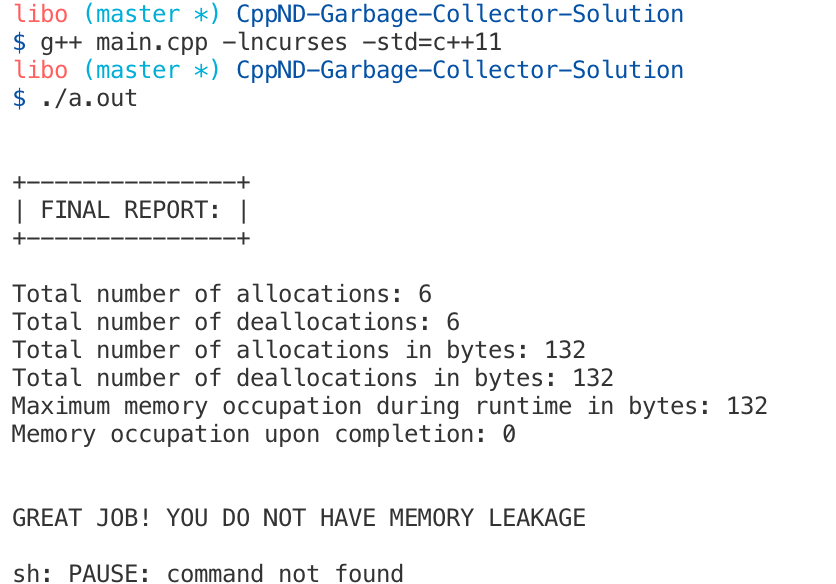

# CppND-Garbage-Collector
The final project for this Memory Management course is to implement your own version of a smart pointer. You can think of this as implementing your own garbage collector, to use a concept from other programming languages. Building this project will help you understand both how to work with pointers and references, and also why smart pointers are so important to modern C++ programming. Complete the implementations and verify that your implementation does not have any memory leaks!

## Project TODO List:
- Complete `Pointer` constructor
  ```cpp
    // Constructor for both initialized and uninitialized objects. -> see class interface
    template<class T,int size>
    Pointer<T,size>::Pointer(T *t){
    // Register shutdown() as an exit function.
    if (first)
        atexit(shutdown);
    first = false;

    // TODO: Implement Pointer constructor
    // Lab: Smart Pointer Project Lab

    // Construct PtrDetails with information about memory block.
    typename std::list<PtrDetails<T> >::iterator it = findPtrInfo(t);
    PtrDetails<T> ptr_details(t, size);
    if(it == refContainer.end()){
        refContainer.push_back(ptr_details);
    }else{
        it->refcount++;
    }

    // Assign instance variables.
    addr = ptr_details.memPtr;
    isArray = ptr_details.isArray;
    arraySize = ptr_details.arraySize;
    
    }

    // Copy constructor.
    template< class T, int size>
    Pointer<T,size>::Pointer(const Pointer &ob){

    // TODO: Implement Pointer constructor
    // Lab: Smart Pointer Project Lab
    // Copy member variables.
    addr = ob.addr;
    isArray = ob.isArray;
    arraySize = ob.arraySize;

    // Increment refcount.
    typename std::list<PtrDetails<T> >::iterator it = findPtrInfo(addr);
    it->refcount++;
    }
  ```
- Complete `Pointer` `operator==`

```cpp
    template <class T, int size>
T *Pointer<T, size>::operator=(T *t){

    // TODO: Implement operator==
    // LAB: Smart Pointer Project Lab
    typename std::list<PtrDetails<T> >::iterator it = findPtrInfo(addr);
    it->refcount--;

    PtrDetails<T> ptr_details(t, size);
    it = findPtrInfo(t);
    if(it == refContainer.end()){
        refContainer.push_back(ptr_details);
    }else{
        it->refcount++;
    }
    // Assign instance variables.
    addr = ptr_details.memPtr;
    isArray = ptr_details.isArray;
    arraySize = ptr_details.arraySize;
    return addr;
    }
```
- Complete `Pointer` destructor

```cpp
    // Destructor for Pointer.
template <class T, int size>
Pointer<T, size>::~Pointer(){
    
    // TODO: Implement Pointer destructor
    // Lab: New and Delete Project Lab
    typename std::list<PtrDetails<T> >::iterator it = findPtrInfo(addr);
    it->refcount--;
    collect();
}
```
- Complete `PtrDetails` class


```cpp
// This class defines an element that is stored
// in the garbage collection information list.
//
template <class T>
class PtrDetails
{
  public:
    unsigned refcount; // current reference count
    T *memPtr;         // pointer to allocated memory
    /* isArray is true if memPtr points
to an allocated array. It is false
otherwise. */
    bool isArray; // true if pointing to array
    /* If memPtr is pointing to an allocated
array, then arraySize contains its size */
    unsigned arraySize; // size of array
    // Here, mPtr points to the allocated memory.
    // If this is an array, then size specifies
    // the size of the array.

    PtrDetails(T* m_ptr, unsigned size=0)
    {
        // TODO: Implement PtrDetails
        // Set reference count to newly allocated memory 1.
        refcount = 1;

        // Assign memPtr to address of newly allocated memory.
        memPtr = m_ptr;

        // If size > 0 then set member variable indicating newly allocated memory is associated with an array.
        if(size != 0) isArray = true;
        else isArray = false;

        arraySize = size;

    }
};
// Overloading operator== allows two class objects to be compared.
// This is needed by the STL list class.
template <class T>
bool operator==(const PtrDetails<T> &ob1,
                const PtrDetails<T> &ob2)
{
    // TODO: Implement operator==
    return (ob1.memPtr == ob2.memPtr);
}
```

## Compilation & Execution

```bash
$ g++ main.cpp -lncurses -std=c++11
$./a.out
```

## Result

After compilation and execution, the result shows the final report with no memory leakage.

